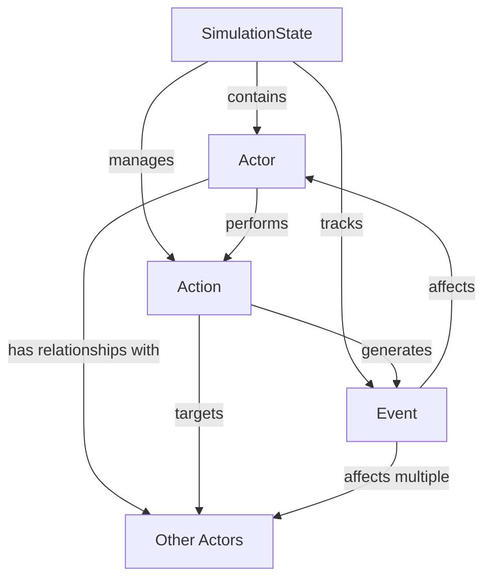

# ScrAI Data Models

## Model Overview

ScrAI uses four core data models that work together to represent the simulation state:

1. **Actor** - Entities that can perform actions
2. **Event** - Things that happen in the simulation world  
3. **Action** - Intentions and behaviors from actors
4. **SimulationState** - Overall state and configuration

## Model Relationships

## Actor Model

### Core Fields
- `id`: Unique identifier
- `name`: Display name
- `type`: ActorType (PLAYER, NPC, ORGANIZATION, ENTITY)
- `active`: Whether actor is active in simulation

### Dynamic Data
- `attributes`: Flexible key-value attributes (health, stats, properties)
- `location`: Current position/region data
- `relationships`: Connections to other actors
- `affiliations`: Group memberships
- `visibility`: What the actor can see/know

### State Tracking
- `created_at`: When actor was created
- `updated_at`: Last modification timestamp
- `metadata`: Additional context data

### Relationships
- **1:N with Actions**: One actor can have many actions
- **M:N with Events**: Events can affect multiple actors
- **M:N with other Actors**: Relationships and affiliations

## Event Model

### Core Fields
- `id`: Unique identifier
- `title`: Brief event name
- `description`: Detailed description
- `type`: EventType (ENVIRONMENTAL, SOCIAL, ECONOMIC, etc.)
- `status`: EventStatus (PENDING, CONFIRMED, RESOLVED, CANCELLED)

### Timing
- `created_at`: When event was generated
- `scheduled_for`: When event should occur
- `resolved_at`: When event was resolved

### Scope and Impact
- `affected_actors`: List of actor IDs affected
- `location`: Where event occurs
- `scope`: Scale (local, regional, global)
- `effects`: Changes this event will cause

### Origin and Causality
- `source`: What generated the event (system, llm, player)
- `trigger_event_id`: Event that caused this one
- `trigger_action_id`: Action that caused this one

### Researcher Mediation
- `requires_approval`: Whether human approval needed
- `approved_by`: Who approved the event
- `modifications`: Changes made by researchers

## Action Model

### Core Fields
- `id`: Unique identifier
- `actor_id`: Who is performing this action
- `type`: ActionType (MOVEMENT, COMMUNICATION, INTERACTION, etc.)
- `intent`: Free-text description of what actor wants to do
- `status`: ActionStatus (PENDING, APPROVED, EXECUTING, COMPLETED, etc.)

### Processing Pipeline
- `llm_parsed`: Whether LLM has processed this action
- `parsed_options`: Structured options generated by LLM
- `selected_option`: Which option was chosen
- `requires_approval`: Whether human approval needed

### Execution
- `scheduled_for`: When action should execute
- `started_at`: When execution began
- `completed_at`: When action finished
- `outcome`: Result of the action
- `generated_events`: Events this action created

### Constraints
- `prerequisites`: Requirements that must be met
- `resource_costs`: Resources needed
- `success_probability`: Calculated chance of success

## SimulationState Model

### Identity
- `id`: Unique simulation identifier
- `name`: Human-readable simulation name
- `description`: What this simulation is about

### Status and Phase Management
- `status`: SimulationStatus (CREATED, RUNNING, PAUSED, COMPLETED, ERROR)
- `current_phase`: SimulationPhase (INITIALIZE, EVENT_GENERATION, etc.)
- `phase_number`: Current turn/phase number

### Configuration
- `max_phases`: Maximum phases before auto-completion
- `scenario_module`: Which scenario system to use
- `configuration`: Simulation parameters
- `researcher_mode`: Enable human oversight
- `auto_approve_events`: Auto-approve LLM events
- `auto_approve_actions`: Auto-approve parsed actions

### World State
- `world_state`: Global state variables
- `environment`: Environmental parameters
- `active_actor_ids`: Currently active actors
- `pending_event_ids`: Events awaiting processing
- `pending_action_ids`: Actions awaiting processing

### Statistics and Monitoring
- `phase_statistics`: Performance data per phase
- `snapshot_count`: Number of snapshots taken
- `error_count`: Number of errors encountered
- `last_error`: Most recent error message

## Data Flow Patterns

### Simulation Lifecycle
1. **SimulationState** created with initial configuration
2. **Actors** created and added to simulation
3. **Events** generated (environmental, scenario-driven)
4. **Actions** submitted by actors
5. **Actions** processed and generate new **Events**
6. **Events** modify **Actors** and world state
7. **SimulationState** updated with new phase

### Action Processing Flow
1. Actor submits Action with free-text intent
2. LLM parses Action into structured options
3. Researcher/system selects option
4. Action approved for execution
5. Action executed, generates Events
6. Events affect Actors and world state

### Event Processing Flow
1. Event generated (from Action or system)
2. Event requires approval (if configured)
3. Researcher reviews and potentially modifies
4. Event confirmed and applied
5. Affected Actors updated
6. World state modified

## Validation Rules

### Actor Validation
- `id` must be unique across all actors
- `name` should be non-empty
- `type` must be valid ActorType
- `location` structure depends on scenario

### Event Validation
- `id` must be unique across all events
- `affected_actors` must reference existing actors
- `trigger_event_id`/`trigger_action_id` must reference existing entities
- Status transitions must follow valid paths

### Action Validation
- `id` must be unique across all actions
- `actor_id` must reference existing actor
- `target_actor_ids` must reference existing actors
- Status transitions must follow valid paths

### SimulationState Validation
- `id` must be unique across all simulations
- `active_actor_ids` must reference existing actors
- `pending_event_ids` must reference existing events
- `pending_action_ids` must reference existing actions
- Phase transitions must follow valid sequence

## Storage Considerations

### Firestore Collections
- Each model type stored in separate collection
- Document IDs match model `id` field
- Automatic timestamps added on create/update

### Indexing Strategy
- Primary queries indexed automatically
- Composite indexes needed for complex queries
- Consider query patterns when designing filters

### Scalability
- Models designed for horizontal scaling
- Avoid deep nesting in dynamic fields
- Use references instead of embedding large objects

### Data Migration
- All models support `to_dict()` and `from_dict()` for serialization
- Pydantic provides automatic validation and type conversion
- Version fields can be added for schema evolution