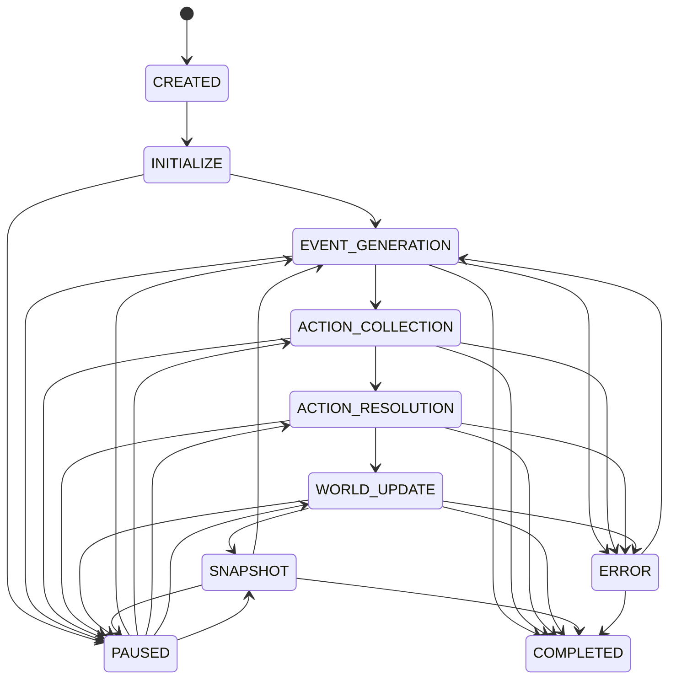
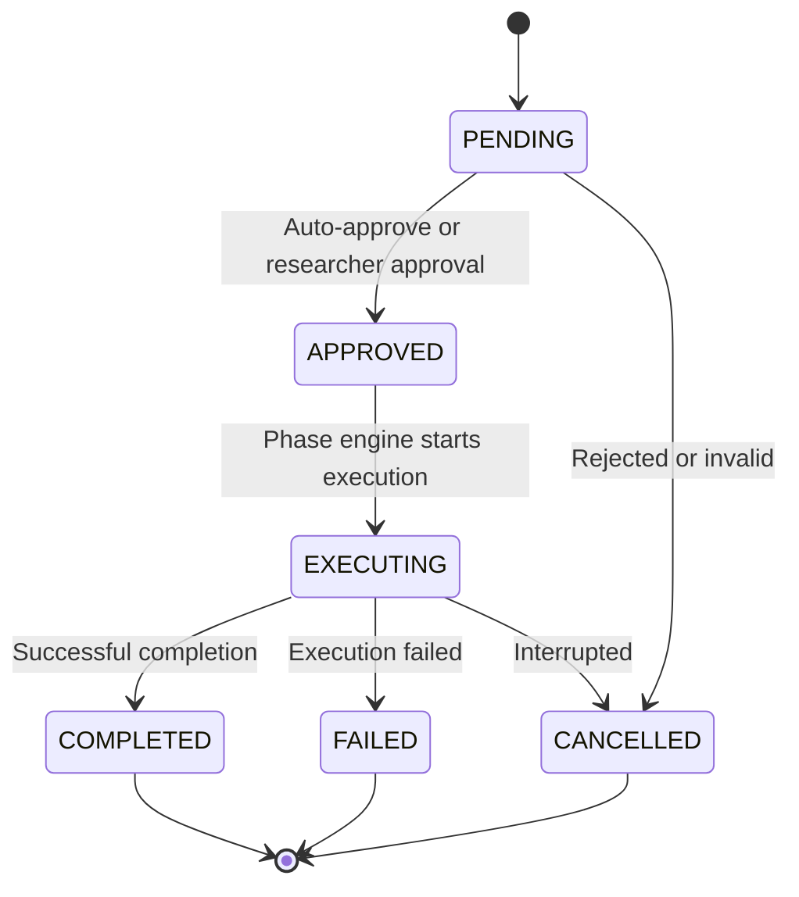
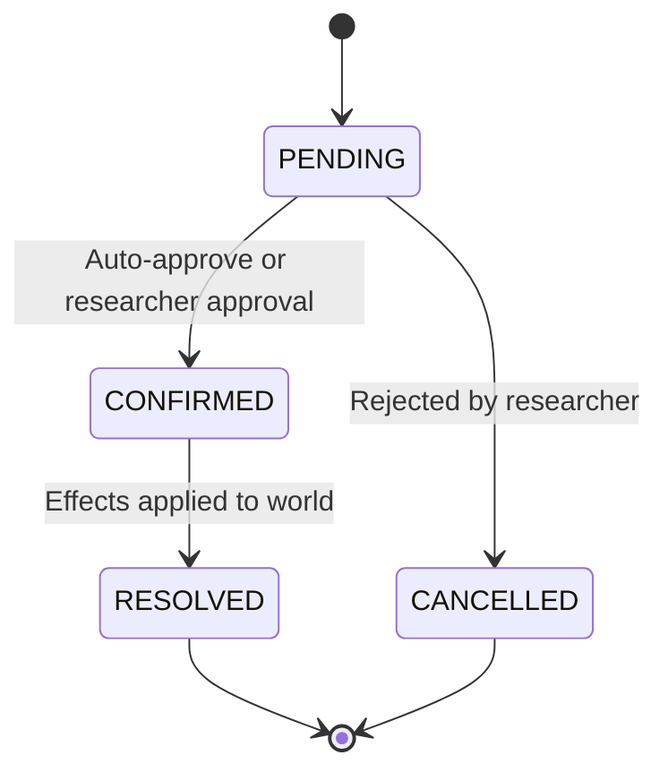
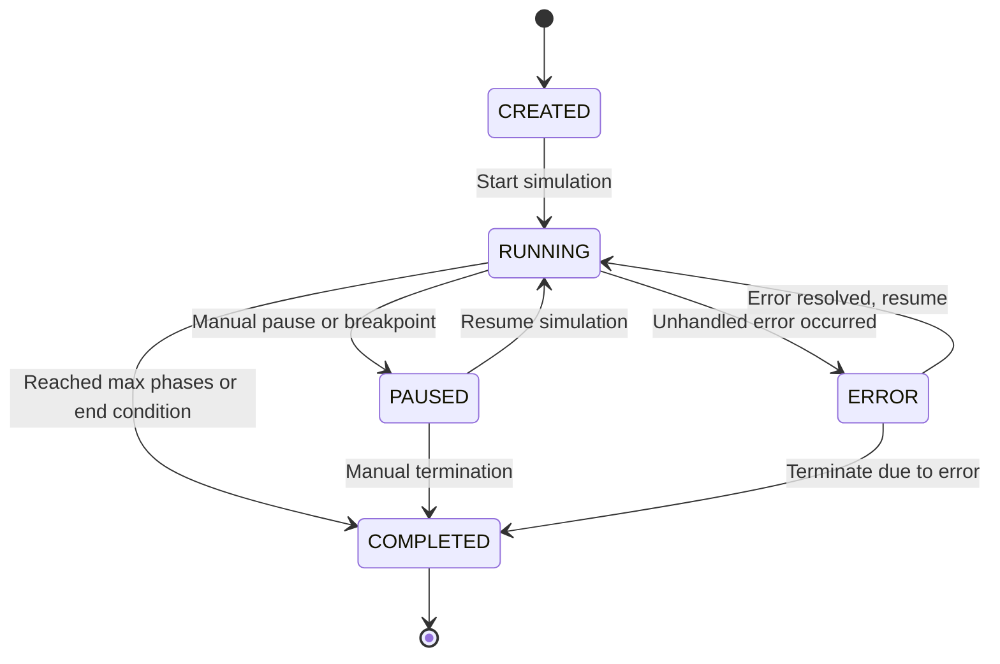

# ScrAI State Transitions

## Simulation Phase Transitions

The simulation follows a structured phase cycle that manages the flow of events and actions.

### Phase Flow Diagram

### Phase Descriptions

#### INITIALIZE
- **Purpose**: Set up initial simulation state
- **Activities**: 
  - Create initial actors from scenario
  - Set world state parameters
  - Initialize environment
- **Next Phase**: EVENT_GENERATION
- **Duration**: One-time setup

#### EVENT_GENERATION
- **Purpose**: Generate environmental and system events
- **Activities**:
  - LLM generates environmental events
  - Scenario modules inject programmatic events
  - Initial entry seeds configured scenario entities when required
  - System events (time passage, resource changes)
- **Next Phase**: ACTION_COLLECTION
- **Duration**: Typically automated

#### ACTION_COLLECTION
- **Purpose**: Gather actions from all actors
- **Activities**:
  - Players submit actions via interface
  - NPC actions generated by LLM
  - Action parsing and validation
- **Next Phase**: ACTION_RESOLUTION
- **Duration**: May wait for player input

#### ACTION_RESOLUTION
- **Purpose**: Process all pending actions
- **Activities**:
  - LLM resolves action conflicts
  - Generate events from actions
  - Calculate success/failure outcomes
- **Next Phase**: WORLD_UPDATE
- **Duration**: Automated processing

#### WORLD_UPDATE
- **Purpose**: Apply all changes to world state
- **Activities**:
  - Update actor attributes
  - Modify world state variables
  - Process cascading effects
- **Next Phase**: SNAPSHOT
- **Duration**: Automated

#### SNAPSHOT
- **Purpose**: Save current state for rollback/analysis
- **Activities**:
  - Create state snapshot
  - Update statistics
  - Check termination conditions
- **Next Phase**: EVENT_GENERATION (new cycle) or COMPLETED
- **Duration**: Automated

#### PAUSED
- **Purpose**: Temporary suspension of simulation
- **Activities**: None, waiting for resume
- **Next Phase**: Return to previous phase
- **Duration**: Until manually resumed

#### COMPLETED
- **Purpose**: Simulation has ended
- **Activities**: Final cleanup and reporting
- **Next Phase**: None (terminal state)

#### ERROR
- **Purpose**: Handle simulation errors
- **Activities**: Error logging and recovery
- **Next Phase**: Can return to previous phase or terminate

## Action Status Transitions

### Action Lifecycle

### Status Descriptions

#### PENDING
- **Initial state** for all new actions
- **Waiting for**: LLM parsing and/or researcher approval
- **Next states**: APPROVED (if approved), CANCELLED (if rejected)

#### APPROVED  
- **Ready for execution** in next resolution phase
- **Waiting for**: Phase engine to process
- **Next states**: EXECUTING (when phase starts)

#### EXECUTING
- **Currently being processed** by phase engine
- **Activities**: LLM resolution, effect calculation
- **Next states**: COMPLETED (success), FAILED (failure), CANCELLED (interrupted)

#### COMPLETED
- **Successfully executed** with results applied
- **Terminal state** - no further transitions
- **Results**: Generated events, updated world state

#### FAILED
- **Execution failed** due to constraints or errors
- **Terminal state** - no further transitions
- **Results**: Failure events, minimal world impact

#### CANCELLED
- **Action was cancelled** before or during execution
- **Terminal state** - no further transitions
- **Results**: No world impact

## Event Status Transitions

### Event Lifecycle

### Status Descriptions

#### PENDING
- **Initial state** for all new events
- **Waiting for**: Researcher approval (if required)
- **Next states**: CONFIRMED (if approved), CANCELLED (if rejected)

#### CONFIRMED
- **Approved for application** to world state
- **Waiting for**: World update phase
- **Next states**: RESOLVED (when effects applied)

#### RESOLVED
- **Effects have been applied** to world and actors
- **Terminal state** - no further transitions
- **Results**: World state updated, actors affected

#### CANCELLED
- **Event was rejected** and will not occur
- **Terminal state** - no further transitions
- **Results**: No world impact

## Simulation Status Transitions

### Simulation Lifecycle

### Status Descriptions

#### CREATED
- **Initial state** after simulation created
- **Activities**: Configuration validation, setup
- **Next states**: RUNNING (when started)

#### RUNNING
- **Active simulation** progressing through phases
- **Activities**: Phase cycle execution
- **Next states**: PAUSED, COMPLETED, ERROR

#### PAUSED
- **Temporarily suspended** by user or system
- **Activities**: None, state preserved
- **Next states**: RUNNING (resume), COMPLETED (terminate)

#### COMPLETED
- **Simulation finished** normally or by termination
- **Terminal state** - no further execution
- **Results**: Final state saved, analysis available

#### ERROR
- **Error occurred** during execution
- **Activities**: Error handling, potential recovery
- **Next states**: RUNNING (if recoverable), COMPLETED (if terminal)

## Transition Triggers

### Automatic Triggers
- **Phase completion**: Automatic advance to next phase
- **Max phases reached**: Auto-complete simulation
- **Error conditions**: Automatic error state
- **Auto-approval**: Skip human approval when configured

### Manual Triggers
- **User commands**: Start, pause, resume, terminate
- **Researcher approval**: Approve/reject events and actions
- **Admin intervention**: Force state changes, error recovery

### System Triggers
- **Time-based**: Scheduled events, timeouts
- **Condition-based**: Thresholds, game rules
- **Resource-based**: Capacity limits, constraints

## Error Handling

### Error Recovery Strategies
1. **Retry**: Attempt operation again
2. **Skip**: Continue without the failed operation
3. **Rollback**: Return to previous stable state
4. **Terminate**: End simulation due to unrecoverable error

### Common Error Scenarios
- **LLM API failures**: Network issues, rate limits
- **Data validation errors**: Invalid state transitions
- **Resource constraints**: Memory, storage, API quotas
- **Logic errors**: Invalid scenario rules, conflicts

### Error State Management
- All errors logged with context
- Error count tracked in SimulationState
- Last error message preserved
- Recovery options presented to user

## Performance Considerations

### State Persistence
- Critical state changes saved immediately
- Bulk updates batched for efficiency
- Snapshots taken at regular intervals

### Concurrency
- Phase transitions are atomic
- Actor updates may be parallelized
- Event processing order matters

### Scalability
- Large actor counts may require batching
- Complex event cascades need careful ordering
- Resource usage monitored and limited